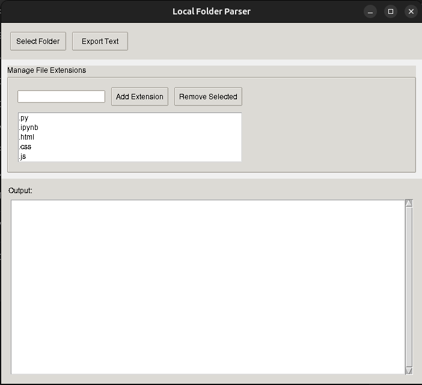

# Local Folder Parser

This is a simple GUI application built with Python and Tkinter that allows you to parse a local repository and display the directory structure and file'scontents into a big prompt for long-context models

## Features

- Select a local folder and display its directory structure.
- Read and display the contents of specific file types (`.py`, `.ipynb`, `.html`, `.css`, `.js`, `.jsx`,`.ts`, `.tsx`, `.rst`, `.md`).
- Export the directory structure and file contents to a text file in the Downloads folder.

## Requirements

- Python 3.x
- Tkinter (usually included with Python installations)

## Installation

1. Clone the repository:
   ```sh
   git clone https://github.com/yourusername/folder2prompt.git
   ```
2. Navigate to the project directory:
   ```sh
   cd folder2prompt
   ```

## Usage

1. Run the application:
   ```sh
   python folder2prompt.py
   ```
2. Click the "Select Folder" button to choose a local folder. The directory structure and file contents will be displayed in the text area.
3. Click the "Export Text" button to export the displayed information to a text file in the Downloads folder. The file will be named with the folder name and the current date.

## Screenshots



## Acknowledgments

This project was inspired by [repo2prompt](https://github.com/andrewgcodes/repo2prompt), and changed to work with local folder, since it was easy to exceed the API limit of GitHub.

## License

This project is licensed under the MIT License. See the [LICENSE](LICENSE) file for details.
